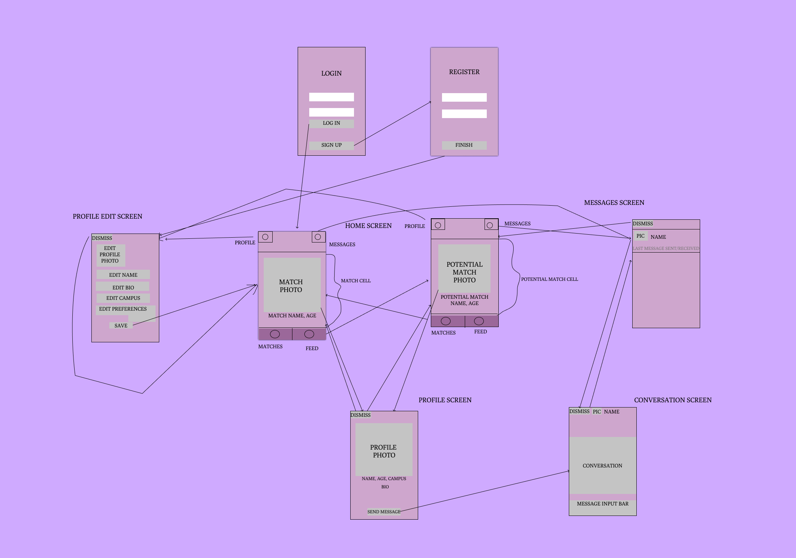

# Blend

## Table of Contents
1. [Overview](#Overview)
1. [Product Spec](#Product-Spec)
1. [Wireframes](#Wireframes)
2. [Schema](#Schema)

## Overview
### Description
Dating App targeted towards college students

### App Evaluation
[Evaluation of your app across the following attributes]
- **Category:** Dating / Social Networking
- **Mobile:** Primarily developed for mobile
- **Story:** Matches user with others based on gender, preference, and campus
- **Market:** College students
- **Habit:** This app would be used regularly by users
- **Scope:** We will begin with simple matching and chatting based on campus, and then maybe explore some more complex matching

## Product Spec

### 1. User Stories (Required and Optional)

**Required Must-have Stories**
- [x] User can register for a new account
- [x] User can login
- [x] User can view matches on their home screen
- [x] User can scroll to find a match
- [x] User can match with someone who attends their school
- [x] User can customize their account


**Optional Nice-to-have Stories**

* User can see conversations from matches

### 2. Screen Archetypes

* Register
   * User signs up for their account
* Login
   * User logs into their account
* Stream
   * User can scroll to find a match
   * User can match with someone who attends their school
* Profile
   * User can edit their name, profile picture and preferences
* Match
   * User can view their matches

### 3. Navigation

**Tab Navigation** (Tab to Screen)

* Stream Tab
* Messages Tab

**Flow Navigation** (Screen to Screen)

* Login
   * Register Screen
   * Home Screen
* Home Screen
   * User Profile Screen
   * Match Screen

## Wireframes

Wireframe created with [Figma](https://www.figma.com/)

### [BONUS] Digital Wireframes & Mockups

### [BONUS] Interactive Prototype

## Schema 
<!-- [This section will be completed in Unit 9] -->

### Models

#### Match Cell

   | Property      | Type     | Description |
   | ------------- | -------- | ------------|
   | objectId      | String   | unique id for the user (default field) |
   | profilePicture| Pointer to User| image user |
   | profileName   | Pointer to user| username string|
   | age           | Pointer to user| age Number |
   | potientialMatch|Bool     | if user is a match true, else false|

#### Profile Cell

   | Property      | Type     | Description |
   | ------------- | -------- | ------------|
   | objectId      | String   | unique id for the user (default field) |
   | profilePicture| Pointer to User| image user |
   | profileName   | Pointer to user| username string|
   | age           | Pointer to user| age Number |
   | campus        | Pointer to user| university String|
   | location      | Pointer to user| location String|
   | bio           | Pointer to user| bio String|

#### Message Cell
   | Property      | Type     | Description |
   | ------------- | -------- | ------------|
   | objectId      | String   | unique id for the user (default field) |
   | profilePicture| Pointer to User| image user |
   | profileName   | Pointer to user| username string|
   | textMessage   | String         | text message send by user|


### Networking

#### List of network requests by screen

- Profile Screen

  - (Update/PUT) Update user profile image

  - (Update/PUT) Update user campus

  - (Update/PUT) Update user bio

  - (Update/PUT) Update user location

- Match Screen

  - (Read/GET) Query Match object

- Message Screen

  - (Create/POST) Create a new message

  - (Delete) Delete an existing message

- Signup Screen
      
  - (Create/POST) Create a new Profile object

     ```swift
     let user = PFUser()
       user.username = usernameField.text
       user.password = passwordField.text
       user.bio = bio.text
       user.campus = campus.text
       user.age = age.text
       
       user.signUpInBackground { (success, error) in
           if success {
               self.performSegue(withIdentifier: "loginSegue", sender: nil)
           }
           else{
               print("Error: \(error?.localizedDescription)")
           }
     ```

- Login Screen
   
  - (Read/GET) Query user Profile object

     ```swift
       let username = usernameField.text!
       let password = passwordField.text!
       
       PFUser.logInWithUsername(inBackground: username, password: password) { (user, error) in    
           if user != nil{
               self.performSegue(withIdentifier: "loginSegue", sender: nil)
           }else {
               print("Error: \(error?.localizedDescription)")
           }
     ```


<!-- - [Create basic snippets for each Parse network request]
- [OPTIONAL: List endpoints if using existing API such as Yelp] -->
